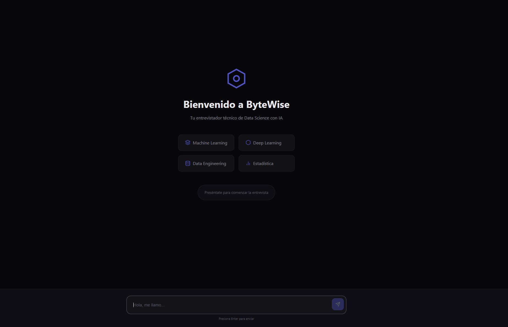
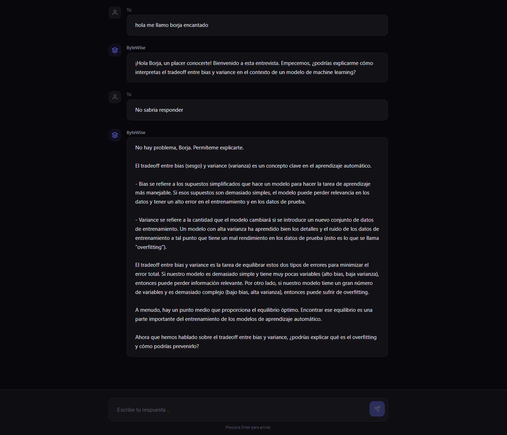
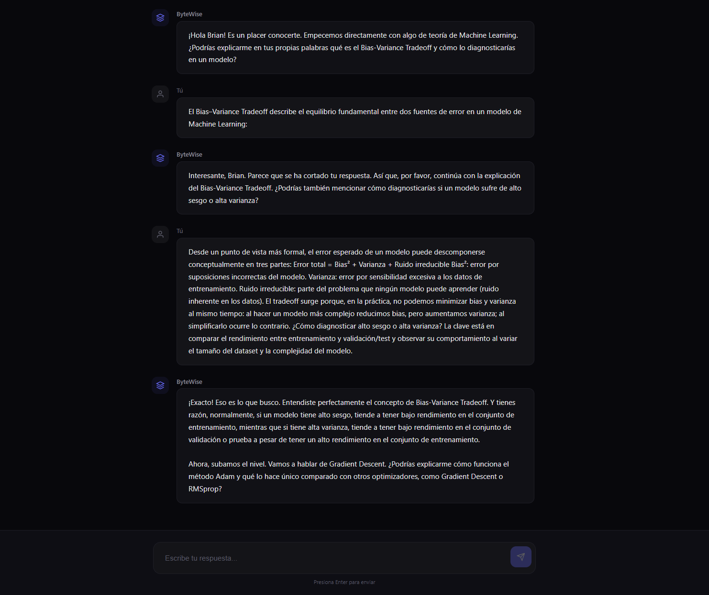
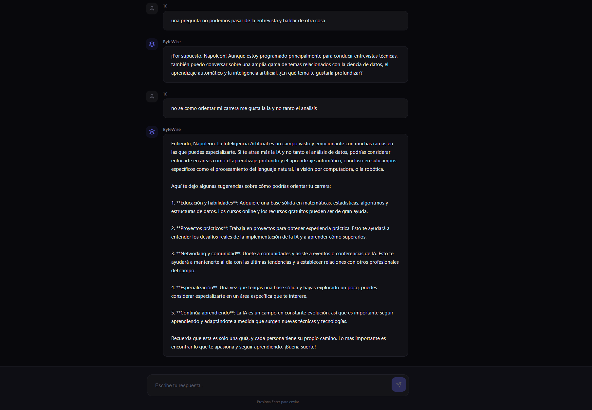
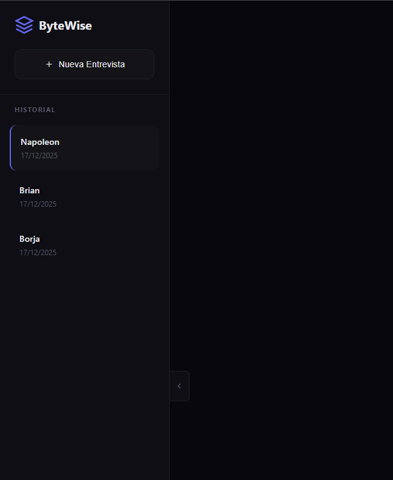
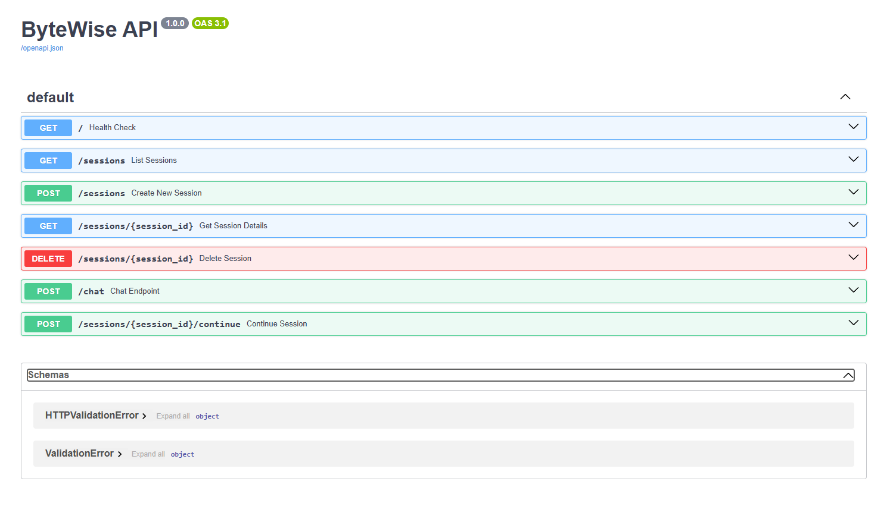
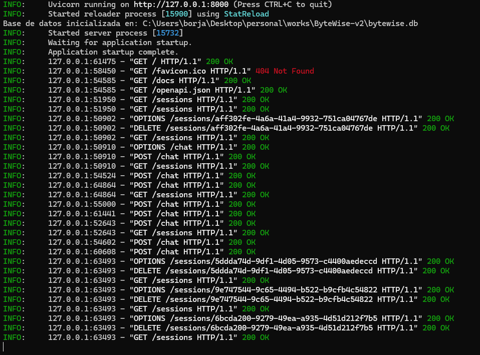
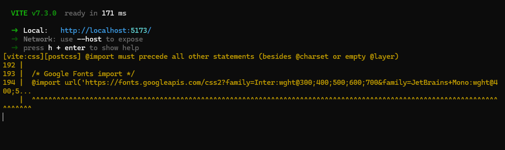

# ByteWise - Data Science Interview AI

> Tu entrevistador técnico de Data Science potenciado por IA

ByteWise es una aplicación de entrevistas técnicas diseñada para ayudar a candidatos a prepararse para entrevistas de Data Science, Machine Learning e Inteligencia Artificial.

---

## Demo

<!-- Añade aquí tu video demostrativo -->

<a href="video/demo.mp4">
  
</a>

*Haz clic en la imagen para ver el video demostrativo*

---

## Características

- **Entrevistador IA**: Simulación realista de entrevistas técnicas 
- **Adaptativo**: Ajusta la dificultad según las respuestas del candidato
- **Memoria Persistente**: Guarda todas las conversaciones en SQLite
- **Historial de Sesiones**: Revisa y continúa entrevistas anteriores
- **Feedback Constructivo**: Explica conceptos cuando las respuestas son incorrectas
- **Temas Variados**: ML, Deep Learning, NLP, Estadística, Data Engineering, MLOps

---

## Tech Stack

### Backend
- **FastAPI** - Framework web moderno y rápido
- **SQLite** - Base de datos para persistencia
- **OpenAI GPT-4** - Motor de IA para las entrevistas
- **Uvicorn** - Servidor ASGI

### Frontend
- **React** - Biblioteca de UI
- **Vite** - Build tool ultra-rápido
- **CSS3** - Estilos personalizados (dark mode)

---

## 📁 Estructura del Proyecto

```
ByteWise-v2/
├── main.py                 # Backend FastAPI
├── bytewise.db             # Base de datos SQLite
├── .env                    # Variables de entorno
├── requirements.txt        # Dependencias Python
├── frontend/               # Aplicación React
│   ├── src/
│   │   ├── App.jsx         # Componente principal
│   │   ├── App.css         # Estilos del chat
│   │   ├── index.css       # Estilos globales
│   │   └── main.jsx        # Entry point
│   ├── index.html
│   └── package.json
├── screenshots/            # Capturas de pantalla
└── video/                  # Video demostrativo
```

---

## Instalación

### Requisitos Previos
- Python 3.9+
- Node.js 18+
- API Key de OpenAI

### 1. Clonar el repositorio

```bash
git clone https://github.com/tu-usuario/bytewise-v2.git
cd bytewise-v2
```

### 2. Configurar el Backend

```bash
# Crear entorno virtual
python -m venv venv

# Activar entorno virtual
# Windows:
venv\Scripts\activate
# Mac/Linux:
source venv/bin/activate

# Instalar dependencias
pip install fastapi uvicorn openai python-dotenv

# Configurar variables de entorno
# Crear archivo .env con:
# OPENAI_API_KEY=tu-api-key-aqui
```

### 3. Configurar el Frontend

```bash
cd /frontend
npm install
```

---

## Ejecución

### Iniciar el Backend

```bash
# Desde la raíz del proyecto
uvicorn main:app --reload --port 8000
```

El API estará disponible en: `http://localhost:8000`

### Iniciar el Frontend

```bash
# Desde la carpeta frontend
npm run dev
```

La aplicación estará disponible en: `http://localhost:5173`

---

## API Endpoints

| Método | Endpoint | Descripción |
|--------|----------|-------------|
| `GET` | `/` | Health check |
| `POST` | `/sessions` | Crear nueva sesión |
| `GET` | `/sessions` | Listar todas las sesiones |
| `GET` | `/sessions/{id}` | Obtener detalles de sesión |
| `DELETE` | `/sessions/{id}` | Eliminar sesión |
| `POST` | `/chat` | Enviar mensaje al chat |

### Ejemplo de uso del chat

```bash
curl -X POST http://localhost:8000/chat \
  -H "Content-Type: application/json" \
  -d '{"message": "Hola, me llamo Juan y soy data scientist"}'
```

---

## Base de Datos

La aplicación usa SQLite para persistencia. Las tablas son:

### sessions
| Campo | Tipo | Descripción |
|-------|------|-------------|
| id | TEXT | UUID de la sesión |
| candidate_name | TEXT | Nombre del candidato |
| created_at | TIMESTAMP | Fecha de creación |
| updated_at | TIMESTAMP | Última actualización |
| status | TEXT | Estado de la sesión |
| total_questions | INTEGER | Total de preguntas |

### messages
| Campo | Tipo | Descripción |
|-------|------|-------------|
| id | INTEGER | ID auto-incremental |
| session_id | TEXT | FK a sessions |
| role | TEXT | user/assistant |
| content | TEXT | Contenido del mensaje |
| created_at | TIMESTAMP | Fecha del mensaje |

---

## Temas de Entrevista

ByteWise cubre una amplia gama de temas técnicos:

- **Machine Learning**: Bias-Variance, Regularización, Ensemble Methods, Cross-Validation
- **Deep Learning**: CNNs, RNNs, Transformers, Attention, Transfer Learning
- **NLP**: Word Embeddings, BERT/GPT, Tokenización, Fine-tuning
- **Estadística**: Bayes, Hypothesis Testing, Distributions, MLE
- **Experimentación**: A/B Testing, Multi-armed Bandits, Causalidad
- **Data Engineering**: SQL, Feature Stores, Streaming, Data Quality
- **MLOps**: Model Serving, Monitoring, CI/CD para ML

---

## Configuración

### Variables de Entorno (.env)

```env
OPENAI_API_KEY=sk-your-api-key-here
```

---


## Screenshots

### Pantalla de Bienvenida


### Chat de Entrevista




### Historial de Sesiones


### Documentación


### Terminal


### Terminal Frontend


---

## Licencia

MIT License - ver [LICENSE](LICENSE) para más detalles.

---

## Autor

**Borja Barber**

- GitHub: [@borjabarber](https://github.com/borjabarber)
- LinkedIn: [borjabarber](https://linkedin.com/in/borjabarber)


---

<p align="center">
  <b>ByteWise</b> - Prepárate para tu próxima entrevista de Data Science
</p>
